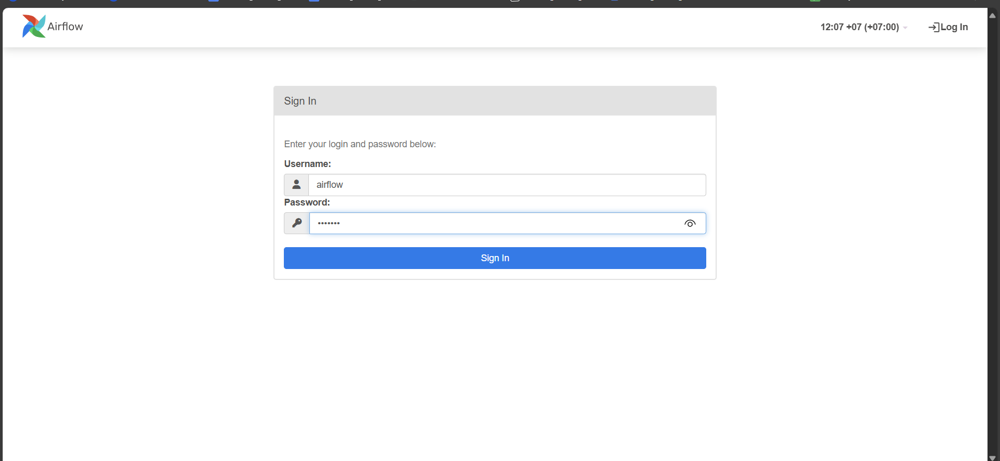
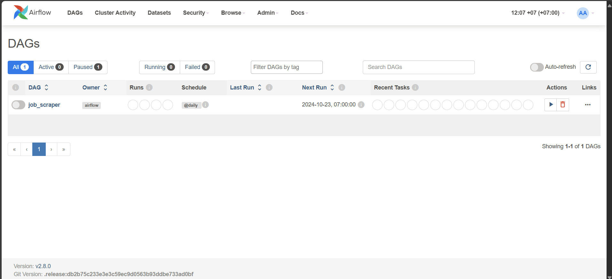
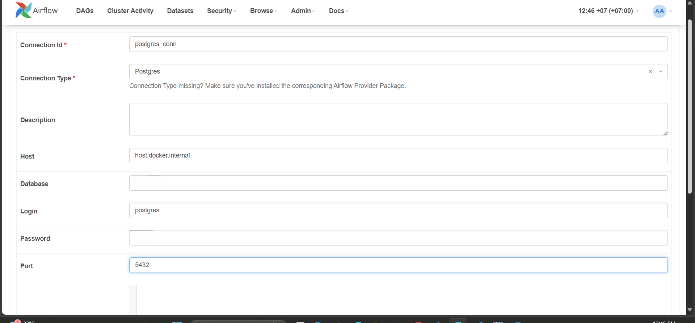
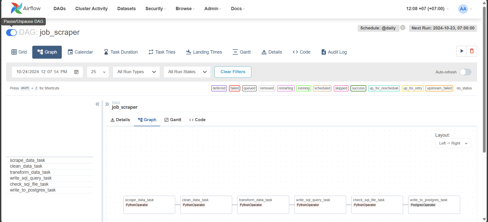
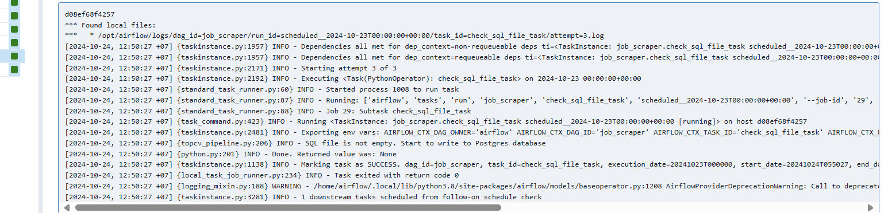
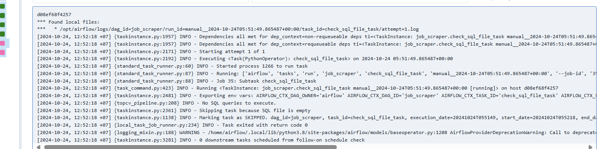

# ***💼 JobScraper: Automated Job Data Pipeline***

## **Overview**
**JobScraper** is a web scraping and data pipeline project designed to automatically extract job postings from the **TOPCV** website (a website that posts job listings in Vietnam). The extracted data is cleaned, transformed, and stored in a structured database for easy querying and analysis. This project provides insights into the current job market and can be extended for data visualization and reporting purposes.


## **🏆 Achievements**

- Stored new jobs daily in the PostgreSQL database to keep an updated repository.
- Cleaned the 'job_name' and 'salary' columns to enhance query performance and ensure accurate data retrieval.
- Created a 'due_date' column to facilitate easy tracking of job deadlines.
- Utilized a stored procedure to update the 'deadline' column daily, for example, changing 'Còn 24 ngày để ứng tuyển' to 'Còn 23 ngày để ứng tuyển' the following day.

## **📕 Table Of Contents**

* [⚙️ Local Setup](#local-setup)
* [💻 Deployment](#deployment)
    - [🛢️ Postgres Setup](#postgres-setup)
    - [🚀 Airflow Setup](#airflow-setup)
    - [📜 SQL Query](#sql-query)
* [📝 Technical Documentation](index.md)

---

## **⚙️ Local Setup**

### Prerequisites

- Install [Docker](https://www.docker.com/products/docker-desktop/) for running Airflow.
- Install [Python](https://www.python.org/).
- Install [PostgreSQL](https://www.postgresql.org/download/).

Clone, fork, or download this GitHub repository on your local machine using the following command:

```bash
git clone https://github.com/lnynhi02/web-scraping-etl-pipeline.git
```

#### Project Structure

```
web-scraping-etl-pipeline/
├── airflow/
│   ├── dags/
│   │   └── topcv_flow.py
│   └── Dockerfile
├── config/
│   └── config.ini
├── pipelines/
│   ├── create_table.py
│   ├── topcv_pipeline.py
│   └── utils.py
├── tmp/
│   ├── last_processed_time.json
│   └── postgres_query.sql
├── .env
├── docker-compose.yaml
└── requirements.txt
```

#### Directory Breakdown

- `airflow/`: Contains `dags/topcv_flow.py`, which holds the DAG responsible for orchestrating the TopCV-related workflow. The Dockerfile builds a custom image based on `apache/airflow:2.8.0`, setting up the Airflow environment and installing Python dependencies. It also installs necessary system libraries, along with tools like `pyvirtualdisplay`, `playwright`, and `Chromium` for browser-based tasks. This setup is tailored for running Airflow workflows that involve web scraping or automated browser interactions.

- `config/`: Contains `config.ini`, which includes the configuration for your PostgreSQL database. Please change the values of the `database` and `password` to your own credentials.

- `pipelines/`: Contains all the core tasks of the pipeline:
    - `create_table.py`: Script for creating PostgreSQL tables.
    - `utils.py`: Functions such as `clean_title`, `clean_salary`, `transform_salary`, and `calculate_dates` for data cleaning and transformation.
    - `topcv_pipeline.py`: Uses functions from `utils.py` to clean and process job data scraped from the web.

- `tmp/`:
    - `last_processed_time.json`: Stores the timestamp of the last processed job.
    - `postgres_query.sql`: Holds the SQL INSERT statements for each job. These files help track processed jobs and insert scraped data into PostgreSQL.

- `docker-compose.yaml`: Configures Airflow services.

---

To set up the local development environment, begin by creating a virtual environment and installing `psycopg2-binary`. This package is only needed to run `create_table.py` locally, so there's no need to install all the packages listed in `requirements.txt` at this point. The packages from `requirements.txt` will be installed later in the Docker environment via the `Dockerfile`.

1. Create a virtual environment:
   ```sh
   python -m venv venv
   ```
2. Activate the virtual environment:
   - **Windows PowerShell:**
     ```sh
     venv\Scripts\Activate
     ```
   - **Linux/macOS:**
     ```sh
     source venv/bin/activate
     ```
3. Install the necessary package:
   ```sh
   pip install psycopg2-binary==2.9.9
   ```
## **💻 Deployment**

### **```Postgres Setup```**
Before setting-up our airflow configurations, let’s create the Postgres database that will persist our data. I prefer using the **pgAdmin 4** tool for this, however any other Postgres development platform can do the job.

When installing postgres, you need to setup a password that we will need later to connect to the database from the Spark environment. **You must remember the password to reconnect to the database servers**. You can also leave the port at 5432. If your installation has succeeded, you can start pgadmin and you should observe something like this window:


Since we have many columns for the table we want to create, we opted to use a script with **psycopg2**, a PostgreSQL database adapter for Python, to create the table and add its columns. And we have installed the **psycopg2-binary** package in the `requirements.txt`.

You can run the Python script with the following command:
```sh
python pipelines/create_table.py
```
I use `config.ini` to access the database configurations, allowing you to modify the application settings easily. Alternatively, if you prefer to use a different method, you can make slight adjustments to the script accordingly. The `config.ini` file looks as follows:
```ini
[database]
host=host.docker.internal
port=5432
user=postgres
password=change_me
database=change_me
```

### **```Airflow Setup```**
Let’s take a look at the Directed Acyclic Graph (DAG) that will outline the sequence and dependencies of tasks, enabling Airflow to manage their execution.
```py
from airflow.providers.postgres.operators.postgres import PostgresOperator
from airflow.operators.python import PythonOperator
from airflow import DAG
import airflow.utils.dates
import logging
import sys
import os

sys.path.append(os.path.join(os.path.dirname(__file__), '..', 'pipelines'))
from topcv_pipeline import scrape_data, clean_data, transform_data, write_sql_query, check_sql_file

logging.basicConfig(level=logging.INFO)
TEMPLATE_SEARCH_PATH = os.path.join(os.path.dirname(__file__), '..', 'tmp')

default_args = {
    'owner': 'airflow',
    'start_date': airflow.utils.dates.days_ago(1)
}

with DAG(
    'job_scraper',
    default_args=default_args,
    template_searchpath=TEMPLATE_SEARCH_PATH,
    schedule_interval='@daily',
    catchup=False
) as dag:
    scrape_data_task = PythonOperator(
        task_id='scrape_data_task',
        python_callable=scrape_data,
        provide_context=True,
        op_kwargs={'url': 'https://www.topcv.vn/viec-lam-it'},
    )

    clean_data_task = PythonOperator(
        task_id='clean_data_task',
        python_callable=clean_data,
        provide_context=True
    )

    transform_data_task = PythonOperator(
        task_id='transform_data_task',
        python_callable=transform_data,
        provide_context=True
    )

    write_sql_query_task = PythonOperator(
        task_id='write_sql_query_task',
        python_callable=write_sql_query,
        provide_context=True
    )

    check_sql_file_task = PythonOperator(
        task_id='check_sql_file_task',
        python_callable=check_sql_file,
        provide_context=True
    )

    write_to_postgres_task = PostgresOperator(
        task_id='write_to_postgres_task',
        postgres_conn_id='postgres_conn',
        sql='postgres_query.sql',
        trigger_rule='all_success'
    )

scrape_data_task >> clean_data_task >> transform_data_task >> write_sql_query_task >> check_sql_file_task >> write_to_postgres_task
```

- The dag includes all the tasks that are imported from the ``topcv_pipeline.py``
- The tasks are set to execute daily.
- The first task is the **Scrape Data Task**. This task scrapes data from the *TOPCV* website into a staging table in Postgres database, initiating the data processing workflow.
- The second task, **Clean Data Task**, will retrieve new, unprocessed jobs from the staging table, clean the 'title' and 'salary' fields by using ``clean_title()`` and ``clean_salary()`` function from ``utils.py``, and then push the cleaned data into XCom for later transformation.
- The third task is the **Transform Data Task**, which pulls cleaned data from XCom, uses the ``transform_salary()`` from ``utils.py`` to calculate the average salary, and then pushes the results back to XCom.
- The fourth task, **Write SQL Query Task**, pulls transformed data from XCom and then generates INSERT SQL commands for each job, saving them to ``postgres_query.sql`` for use with the ``PostgresOperator`` in downstream task.
- The fifth task, **Check SQL File Task**, checks whether the ``postgres_query.sql`` file contains any SQL commands. If it does, the downstream tasks will be executed; if the file is empty, the downstream tasks will be skipped.
- The final task is the **Write To Postgres Task**. It uses the **PostgresOperator** for execution, running the SQL commands from the ``postgres_query.sql`` file and storing the jobs in the PostgreSQL database.

Now, we just need to run Airflow in Docker. However, we need to create some environment variables that will be used by ***docker-compose***.

#### Linux:
```sh
echo -e "AIRFLOW_UID=$(id -u)" > .env
```

#### Windows:
Find the UID by running:
```sh
whoami /user
```
Take the 4 numbers at the end and run:
```sh
Set-Content -Path .env -Value "AIRFLOW_UID=xxxx"
```

#### Create `airflow/logs/` folder:
- **Windows (PowerShell):**
  ```sh
  New-Item -ItemType Directory -Path "airflow/logs"
  ```
- **Linux:**
  ```sh
  mkdir -p airflow/logs
  ```

#### Start Airflow:
```sh
docker network create airflow
docker-compose up -d
```

Now we can access the Airflow UI at ``localhost:8080``. Use the username ``airflow`` and the password ``airflow`` to log in.



- We can see the dag `job_scraper`. 



- Before running the DAG, we need to establish a ***Postgres Connection*** in Airflow to enable connectivity with the Postgres database. This connection is essential for executing the `write_to_postgres_task` using the `PostgresOperator`.

- Navigate to the **Admin** section at the top and select **Connections**. Then, click on the **+** icon to add a new connection.


- Since we are connecting from Airflow running in a Docker container, set the host to **host.docker.internal**. Ensure you also enter your **database** name and **password** accordingly. The **Connection ID** will later be utilized in the **postgres_conn_id** parameter within the `write_to_postgres_task`.



- Let's go and run the DAG.



- You can monitor the log for each task to gain insights into the scraping process and see how many jobs have been collected.





### **```SQL Query```**
Once all the data is loaded into the database, we need to perform some cleaning.
```sql
UPDATE jobs_table
SET salary = NULL
WHERE salary = 'Thỏa thuận';

ALTER TABLE jobs_table
ALTER COLUMN salary TYPE numeric USING salary::numeric;

ALTER TABLE jobs_table
ALTER COLUMN salary TYPE integer USING ROUND(salary);
```

We need to create a stored procedure to update the remaining time for jobs that are still open for applications.
```sql
CREATE OR REPLACE PROCEDURE update_deadline()
LANGUAGE plpgsql
AS $$
DECLARE
    job_record RECORD;
    time_remaining INTERVAL;
BEGIN
    FOR job_record IN SELECT * FROM jobs_table LOOP
        time_remaining = jobs_table.due_date - CURRENT_TIMESTAMP;
        
        IF time_remaining > INTERVAL '0 seconds' THEN 
            IF time_remaining < INTERVAL '1 minutes' THEN
                UPDATE jobs_table
                SET remaining_time = 'Còn ' || EXTRACT(SECOND FROM time_remaining) || ' giây để ứng tuyển'
                WHERE job_link = job_record.job_link;
            ELSIF time_remaining < INTERVAL '1 hour' THEN
                UPDATE jobs_table
                SET remaining_time = 'Còn ' || EXTRACT(MINUTE FROM time_remaining) || ' phút để ứng tuyển'
                WHERE job_link = job_record.job_link;
            ELSIF time_remaining < INTERVAL '1 day' THEN 
                UPDATE jobs_table
                SET remaining_time = 'Còn ' || EXTRACT(HOUR FROM time_remaining) || ' giờ để ứng tuyển'
                WHERE job_link = job_record.job_link;
            ELSE
                UPDATE jobs_table
                SET remaining_time = 'Còn ' || EXTRACT(DAY FROM time_remaining) || ' ngày để ứng tuyển'
                WHERE job_link = job_record.job_link;
            END IF;
        ELSE
            UPDATE jobs_table
            SET remaining_time = 'Đã hết thời gian ứng tuyển'
            WHERE job_link = job_record.job_link;
        END IF;
    END LOOP;
END;
$$;
```

#### **Querying Data**
```sql
-- Get a list of jobs with application deadline within the next 10 days
SELECT job_name, job_link, salary, job_location, remaining_time, due_date
FROM jobs_table
WHERE due_date <= NOW() + INTERVAL '20 DAYS';

-- Find jobs with salary greater than 15 million VND
SELECT job_name, job_link, company_name, salary, job_location
FROM jobs_table
WHERE salary > 15;

-- Get a list of jobs in order of the most recently posted
SELECT job_name, company_name, posted_date
FROM jobs_table
ORDER BY posted_date DESC;

-- Get the total number of jobs available in Ho Chi Minh City
SELECT COUNT(*)
FROM jobs_table
WHERE job_location LIKE '%Hồ Chí Minh%';

-- Find the top 10 highest-paying jobs in Ho Chi Minh City
SELECT job_name, job_link, company_name, salary
FROM jobs_table
WHERE job_location LIKE '%Hồ Chí Minh%'
ORDER BY salary DESC
LIMIT 10;
```

## [Technical Documentation](deployment.md)