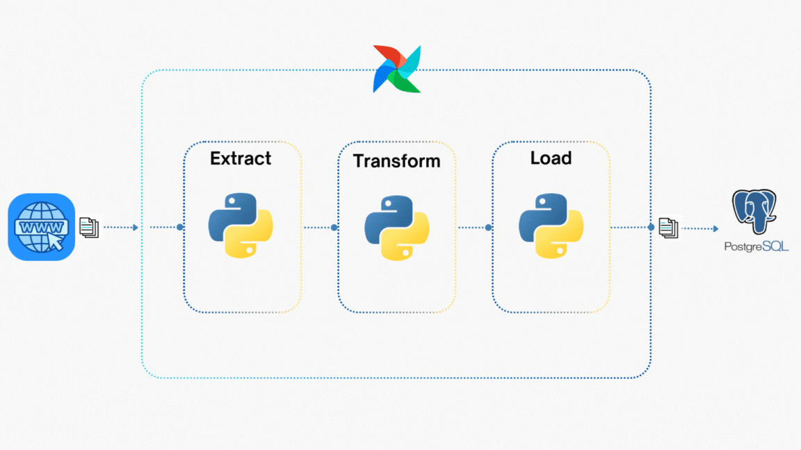

# ***DOCUMENTATION***

## **Overview**
This pipeline is designed to automate the extraction, processing, and storage of job postings from the TOPCV website. It ensures data is cleaned, transformed, and structured for efficient querying and analysis. The processed data can be further utilized for visualization and reporting.

For a step-by-step deployment guide, visit the [Deployment](deployment.md). Happy coding!

## **System Architecture**

<p align="center">
    
</p>

1. **Data Ingestion**: The pipeline collects job postings from the [TOPCV](https://www.topcv.vn/viec-lam-it) website, extracting relevant information for further processing.

2. **Data Processing**: Extracted data is cleaned, transformed, and formatted to ensure consistency before being stored in a PostgreSQL database.

3. **Workflow Orchestration**: Airflow manages and schedules the entire workflow, automating data extraction, processing, and storage while maintaining task dependencies and execution order.

## **Technical Notes**
### ***1. Error Handling***
To ensure data integrity and prevent unnecessary execution of downstream tasks, the pipeline includes error-handling mechanisms.

**SQL File Validation:** Before executing database operations, the `check_sql_file` task verifies whether the `postgres_query.sql` file contains any `INSERT` statements.

If the file is empty, the pipeline raises an `AirflowSkipException`, preventing unnecessary execution.

```python
def check_sql_file(**kwargs):
    postgres_sql_file = os.path.join(os.path.dirname(__file__), '..', 'tmp', 'postgres_query.sql')

    if os.path.exists(postgres_sql_file) and os.path.getsize(postgres_sql_file) > 0:
        logging.info("SQL file is not empty. Proceeding with execution.")
    else:
        logging.info("No SQL queries to execute.")
        raise AirflowSkipException("Skipping task because SQL file is empty")
```

### ***2. Web Scraping with Playwright***
Initially, **BeautifulSoup** was considered for web scraping; however, due to website restrictions, **Playwright** was used instead.

- **Headless Mode Issues:** Running Playwright in `headless=True` mode caused failures, so `headless=False` was used.
- **Virtual Display Setup:** To avoid UI rendering issues in a containerized environment, `pyvirtualdisplay` is installed.

### ***3. Data Processing & Storage***
The pipeline follows a structured data processing workflow:

- **Staging Table:** Data is first written to a staging table before transformation.
- **Cleaning & Transformation:** Data is cleaned and formatted using `DictCursor` to access table columns as *key-value pairs*. Using `DictCursor` enables direct access to values, for example by calling `job['title']`, which enhances code readability and maintainability.
- **Incremental Processing:** Only new job postings (`posted_date > last_processed_time`) are processed to avoid duplication.

```python
def clean_data(**kwargs):
    conn = get_connection()
    cur = conn.cursor(cursor_factory=DictCursor)

    query = "SELECT * FROM staging_table"
    last_processed_time = read_last_processed_time()

    if last_processed_time:
        query += " WHERE posted_date > %s"
        cur.execute(query, (last_processed_time,))
    else:
        cur.execute(query)

    scraped_jobs = cur.fetchall()
    cleaned_jobs = []
    for job in scraped_jobs:
        cleaned_jobs.append({
            'title': clean_title(job['job_name']),
            'salary': clean_salary(job['salary']),
            'company': job['job_company'],
            'update': pendulum.instance(job['posted_date']).in_timezone('Asia/Ho_Chi_Minh'),
        })

    kwargs['ti'].xcom_push(key='cleaned_data', value=cleaned_jobs)
```

### ***4. Timezone Management with Pendulum***
Airflow runs all timestamps in **UTC** by default, which can cause inconsistencies.
To avoid this, the **pendulum** library ensures all timestamps are converted to `Asia/Ho_Chi_Minh`(my local timezone) before pushing data to XCom.

```python
transformed_jobs.append({
    'update': pendulum.instance(job['posted_date']).in_timezone('Asia/Ho_Chi_Minh'),
    'due_date': pendulum.instance(job['due_date']).in_timezone('Asia/Ho_Chi_Minh')
})
```

### ***5. Data Transfer Using XCom***
To maintain a structured data flow, **Airflow’s XCom** is used for inter-task communication.

- The `clean_data` task pushes processed job postings to XCom.
- The `transform_data` task pulls this data for further processing.
- Finally, `write_sql_query` generates SQL commands based on transformed data.

## **Future Enhancements & Limitations**

### ***Limitations***

#### XCom Data Size Limit
Airflow's XCom is designed for small data exchanges between tasks.

- Storing large datasets (e.g., full job listings) might have a memory overflow error.
- Airflow XComs have a limited size and that depeonds on the database we use:
    - The default size limit for an XCom value stored in the Airflow metadata database is 48KB.  
    - SQLite: 2GB
    - Postgres: 1GB
    - MySQL: 64KB

Ref: <a href="https://marclamberti.com/blog/airflow-xcom/#XCom_limitations" target="_blank">https://marclamberti.com/blog/airflow-xcom/#XCom_limitations</a>

### ***Future Enhancements***

#### 1. Automated Reporting & Visualization  

After storing job data, the next step could be to *generate reports* or *integrate with BI tools*.  

🔹 **Possible options:**  
- Exporting reports to *Google Sheets, Excel, or PDFs*.  
- Connecting *PostgreSQL* with *Power BI, Metabase, or Superset* for visualization. 

#### 2. Stream Processing for Real-Time Job Scraping  

Currently, the pipeline operates in *batch mode*, meaning job postings are scraped and processed at scheduled intervals. This may cause delays in updating the latest job listings.  

🔹 **Enhancement**: Introduce *stream processing* to handle job postings in real time.  

**Approach**  
- Continuously monitor job listings for updates.  
- Trigger data ingestion as soon as a new job posting appears.  
- Store real-time data in a temporary location (e.g., **Kafka, Redis, or a staging table**).  

**Hybrid Processing**  
- **Streaming Mode**: Ingest and process new postings in real-time.  
- **Batch Mode**: Run scheduled jobs for historical data analysis and reporting.  


### ***Conclusion***
Although this pipeline still has limitations and room for improvement, it has been a great learning experience. It pushed me to think about error handling, data flow between tasks, and different ways to utilize Airflow more effectively. Most importantly, this pipeline helped me develop problem-solving skills—thinking critically and exploring alternative approaches when tackling challenges.

There is no best—only better, and the same applies to this pipeline. Every challenge has been a step toward improvement, and each iteration brings new insights, reinforcing the mindset that continuous learning and refinement are key to building robust data workflows.s

